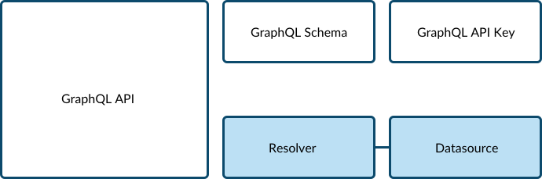
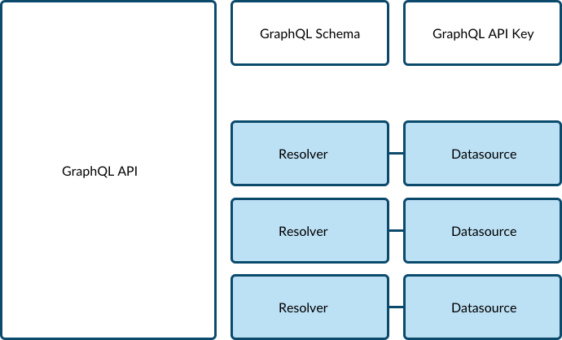
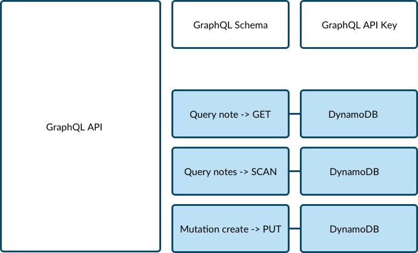
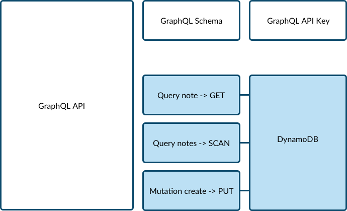

# Appsync Intro

## Overview

In our Appsync app, we are going to create the following resources:

We will create a Appsync GraphQL resource and attach some config resources to it, such as our schema and api key. Although we have only 1 schema, we will potentially have many resolvers and datasources

In our case, we are using DynamoDB as a datasource, and many resolvers which correspond to our schemas query and mutation definitions.

Although we can have many datasources, in our example, we will be using 1 DynamoDB datasource, and defining multiple resolvers to act against it.

## Helpful Documentation

-   [Cloudformation: Appsync GraphQL Resource](https://docs.aws.amazon.com/AWSCloudFormation/latest/UserGuide/aws-resource-appsync-graphqlapi.html)

-   [Cloudformation: Appsync Schema Resource](https://docs.aws.amazon.com/AWSCloudFormation/latest/UserGuide/aws-resource-appsync-graphqlschema.html)

-   [Cloudformation: Appsync API KEY Resource](https://docs.aws.amazon.com/AWSCloudFormation/latest/UserGuide/aws-resource-appsync-apikey.html)

-   [Cloudformation: Appsync Datasource Resource](https://docs.aws.amazon.com/AWSCloudFormation/latest/UserGuide/aws-resource-appsync-datasource.html)

-   [Cloudformation: Appsync Resolver Resource](https://docs.aws.amazon.com/AWSCloudFormation/latest/UserGuide/aws-resource-appsync-resolver.html)

-   [VTL: Resolver Mapping Template Reference](https://docs.aws.amazon.com/appsync/latest/devguide/resolver-mapping-template-reference.html)

## Intructions

-   `sam build`
-   `sam deploy --guided`

We will have to change the capabilities setting in our toml file to:
`capabilities = "CAPABILITY_NAMED_IAM"`
